# Vision-Centric-BEV-Perception
Vision-Centric BEV Perception: A Survey

[comment]: <> (<p align="center"> 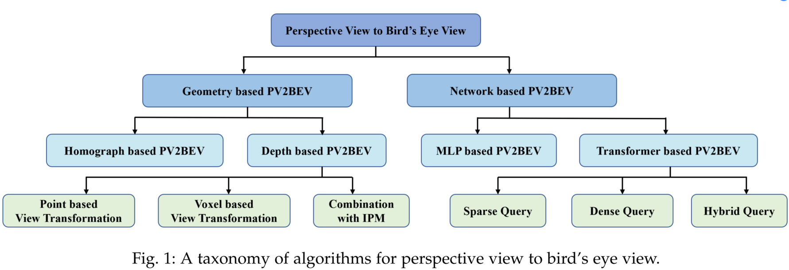 </p>)


## Introduction


### (1) Datasets


[comment]: <> (<p align="center"> 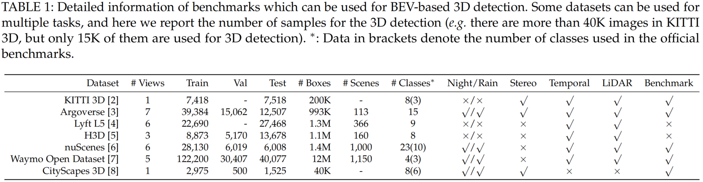 </p>)
### (2) GEOMETRY BASED PV2BEV
#### Homograph based PV2BEV
Public Papers:
- IPM: Inverse perspective mapping simplifies optical flow computation and obstacle detection (Biological Cybernetics'1991) [[paper]](https://link.springer.com/article/10.1007/BF00201978)
- DSM: Automatic Dense Visual Semantic Mapping from Street-Level Imagery (IROS'12) [[paper]](https://www.robots.ox.ac.uk/~tvg/publications/2012/IROS_Mapping_ss.pdf)
- MapV: Learning to map vehicles into bird’s eye view (ICIAP'17) [[paper]](https://arxiv.org/abs/1706.08442)
- BridgeGAN: Generative Adversarial Frontal View to Bird View Synthesis (3DV'18) [[paper]](https://arxiv.org/pdf/1808.00327.pdf)[[project page]](https://github.com/xinge008/BridgeGAN)
- VPOE: Deep learning based vehicle position and orientation estimation via inverse perspective mapping image (IV'19) [[paper]](https://ieeexplore.ieee.org/document/8814050)
- 3D-LaneNet: End-to-End 3D Multiple Lane Detection (ICCV'19) [[paper]](https://openaccess.thecvf.com/content_ICCV_2019/papers/Garnett_3D-LaneNet_End-to-End_3D_Multiple_Lane_Detection_ICCV_2019_paper.pdf)
- The Right (Angled) Perspective: Improving the Understanding of Road Scenes Using Boosted Inverse Perspective Mapping (IV'19) [[paper]](https://arxiv.org/abs/1812.00913)
- Cam2BEV: A Sim2Real Deep Learning Approach for the Transformation of Images from Multiple Vehicle-Mounted Cameras to a Semantically Segmented Image in Bird’s Eye View (ITSC'20) [[paper]](https://arxiv.org/abs/2005.04078) [[project page]](https://github.com/ika-rwth-aachen/Cam2BEV)
- MonoLayout: Amodal Scene Layout from a Single Image (WACA'20) [[paper]](https://arxiv.org/abs/2002.08394) [[project page]](https://github.com/hbutsuak95/monolayout)
- MVNet: Multiview Detection with Feature Perspective Transformation (ECCV'20) [[paper]](https://arxiv.org/abs/2007.07247) [[project page]](https://github.com/hou-yz/MVDet)
- OGMs: Driving among Flatmobiles: Bird-Eye-View occupancy grids from a monocular camera for holistic trajectory planning (WACA'21) [[paper]](https://arxiv.org/abs/2008.04047) [[project page]]()
- TrafCam3D: Monocular 3D Vehicle Detection Using Uncalibrated Traffic Camerasthrough Homography (IROS'21) [[paper]](https://arxiv.org/pdf/2103.15293.pdf) [[project page]](https://github.com/minghanz/trafcam_3d)
- SHOT:Stacked Homography Transformations for Multi-View Pedestrian Detection (ICCV'21) [[paper]](https://openaccess.thecvf.com/content/ICCV2021/papers/Song_Stacked_Homography_Transformations_for_Multi-View_Pedestrian_Detection_ICCV_2021_paper.pdf)
- HomoLoss: Homography Loss for Monocular 3D Object Detection (CVPR'22) [[paper]](https://arxiv.org/abs/2204.00754)

Chronological Overview:

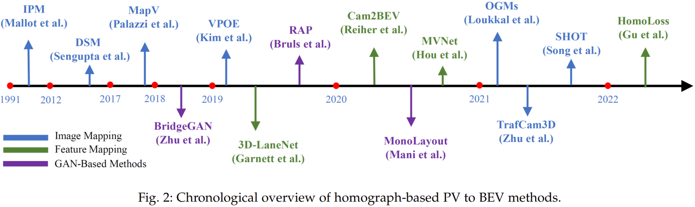

[comment]: <> (<p align="center">  </p>)
#### Depth based PV2BEV
Public Papers:
- OFT: Orthographic Feature Transform for Monocular 3D Object Detection (BMVC'19) [[paper]](https://arxiv.org/pdf/1811.08188) [[project page]](https://github.com/tom-roddick/oft)
- CaDDN: Categorical Depth Distribution Network for Monocular 3D Object Detection (CVPR'21) [[paper]](https://openaccess.thecvf.com/content/CVPR2021/papers/Reading_Categorical_Depth_Distribution_Network_for_Monocular_3D_Object_Detection_CVPR_2021_paper.pdf) [[project page]](https://github.com/TRAILab/CaDDN)
- DSGN: Deep Stereo Geometry Network for 3D Object Detection (CVPR'20) [[paper]](https://arxiv.org/pdf/2001.03398) [[project page]](https://github.com/dvlab-research/DSGN)
- Lift, Splat, Shoot: Encoding Images From Arbitrary Camera Rigs by Implicitly Unprojecting to 3D (ECCV'20) [[paper]](https://arxiv.org/pdf/2008.05711.pdf) [[project page]](https://nv-tlabs.github.io/lift-splat-shoot/)
- PanopticSeg: Bird’s-Eye-View Panoptic Segmentation Using Monocular Frontal View Images (RA-L'22) [[paper]](https://ieeexplore.ieee.org/document/9681287) [[project page]](http://panoptic-bev.cs.uni-freiburg.de/)
- FIERY: Future Instance Prediction in Bird’s-Eye View from Surround Monocular Cameras (ICCV'21) [[paper]](https://openaccess.thecvf.com/content/ICCV2021/papers/Hu_FIERY_Future_Instance_Prediction_in_Birds-Eye_View_From_Surround_Monocular_ICCV_2021_paper.pdf) [[project page]](https://github.com/wayveai/fiery)
- LIGA-Stereo: Learning LiDAR Geometry Aware Representations for Stereo-based 3D Detector (ICCV'21) [[paper]](https://xy-guo.github.io/liga/liga-guo-iccv21.pdf) [[project page]](https://xy-guo.github.io/liga/)
- ImVoxelNet: Image to Voxels Projection for Monocular and Multi-View General-Purpose 3D Object Detection (WACV'22) [[paper]](https://arxiv.org/pdf/2106.01178.pdf) [[project page]](https://github.com/saic-vul/imvoxelnet)
- BEVDet: High-performance Multi-camera 3D Object Detection in Bird-Eye-View (Arxiv'21) [[paper]](https://arxiv.org/pdf/2112.11790) [[project page]](https://github.com/HuangJunJie2017/BEVDet)
- M^2BEV: Multi-Camera Joint 3D Detection and Segmentation with Unified Bird’s-Eye View Representation (Arxiv'22) [[paper]](https://arxiv.org/pdf/2204.05088) [[project page]](https://nvlabs.github.io/M2BEV/)
- StretchBEV: Stretching Future Instance Prediction Spatially and Temporally (ECCV'22) [[paper]](https://arxiv.org/pdf/2203.13641) [[project page]](https://github.com/kaanakan/stretchbev)
- DfM: Monocular 3D Object Detection with Depth from Motion (ECCV'22) [[paper]](https://arxiv.org/pdf/2207.12988.pdf) [[project page]](https://github.com/Tai-Wang/Depth-from-Motion)
- BEVDet4D: Exploit Temporal Cues in Multi-camera 3D Object Detection (Arxiv'22) [[paper]](https://arxiv.org/pdf/2203.17054) [[project page]](https://github.com/HuangJunJie2017/BEVDet)
- BEVerse: Unified Perception and Prediction in Birds-Eye-View for Vision-Centric Autonomous Driving (Arxiv'22) [[paper]](https://arxiv.org/pdf/2205.09743) [[project page]](https://github.com/zhangyp15/BEVerse)
- MV-FCOS3D++: Multi-View Camera-Only 4D Object Detection with Pretrained Monocular Backbones (Arxiv'22) [[paper]](https://arxiv.org/pdf/2207.12716) [[project page]](https://github.com/Tai-Wang/Depth-from-Motion)
- Putting People in their Place: Monocular Regression of 3D People in Depth (CVPR'22) [[Code]](https://github.com/Arthur151/ROMP) [[Project Page]](https://arthur151.github.io/BEV/BEV.html) [[Paper]](https://arxiv.org/abs/2112.08274) [[Video]](https://youtu.be/Q62fj_6AxRI) [[RH Dataset]](https://github.com/Arthur151/Relative_Human)

Chronological Overview:

[comment]: <> (<p align="center"> 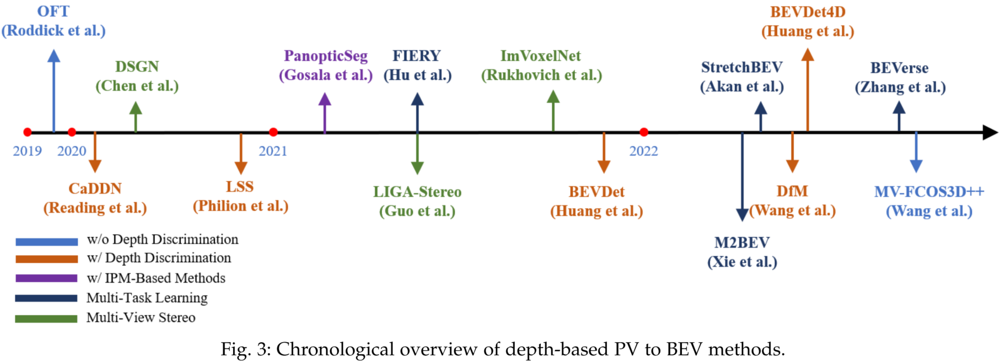 </p>)


Benchmark Results:

[comment]: <> (<p align="center">  </p>)


### (3) NETWORK BASED PV2BEV
#### MLP based PV2BEV
Public Papers:
- VED: Monocular Semantic Occupancy Grid Mapping with Convolutional Variational Encoder-Decoder Networks (RA-L'19) [[paper]](https://arxiv.org/pdf/1804.02176.pdf) [[project page]](https://github.com/Chenyang-Lu/mono-semantic-occupancy)
- VPN: Cross-view Semantic Segmentation for Sensing Surroundings (IROS'20) [[paper]](https://arxiv.org/pdf/1906.03560.pdf) [[project page]](https://view-parsing-network.github.io/)
- FishingNet: Future Inference of Semantic Heatmaps In Grids (Arxiv'20) [[paper]](https://arxiv.org/pdf/2006.09917)
- PON: Predicting Semantic Map Representations from Images using Pyramid Occupancy Networks (CVPR'20) [[paper]](https://openaccess.thecvf.com/content_CVPR_2020/papers/Roddick_Predicting_Semantic_Map_Representations_From_Images_Using_Pyramid_Occupancy_Networks_CVPR_2020_paper.pdf) [[project page]](https://github.com/tom-roddick/mono-semantic-maps)
- STA-ST: Enabling spatio-temporal aggregation in Birds-Eye-View Vehicle Estimation (ICRA'21) [[paper]](https://cvssp.org/Personal/OscarMendez/papers/pdf/SahaICRA2021.pdf) 
- HDMapNet: An Online HD Map Construction and Evaluation Framework (ICRA'22) [[paper]](https://arxiv.org/pdf/2107.06307) [[project page]](https://tsinghua-mars-lab.github.io/HDMapNet/)
- Projecting Your View Attentively: Monocular Road Scene Layout Estimation via Cross-view Transformation (CVPR'21) [[paper]](https://openaccess.thecvf.com/content/CVPR2021/papers/Yang_Projecting_Your_View_Attentively_Monocular_Road_Scene_Layout_Estimation_via_CVPR_2021_paper.pdf) [[project page]](https://github.com/JonDoe-297/cross-view)
- HFT: Lifting Perspective Representations via Hybrid Feature Transformation (Arxiv'22) [[paper]](https://arxiv.org/pdf/2204.05068) [[project page]](https://github.com/JiayuZou2020/HFT)

Chronological Overview:

[comment]: <> (<p align="center">  </p>)
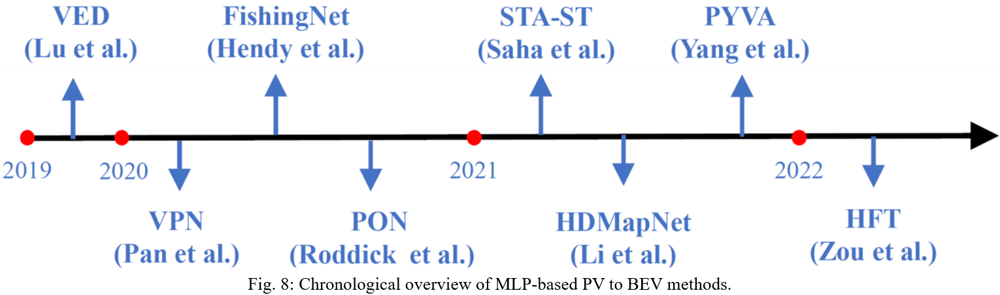

Benchmark Results:

[comment]: <> (<p align="center"> 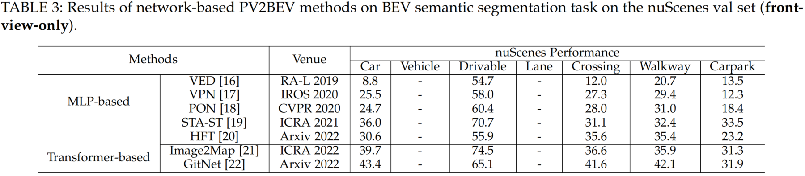 </p>)


#### Transformer based PV2BEV
Public Papers:
- STSU: Structured Bird’s-Eye-View Traffic Scene Understanding from Onboard Images (ICCV'21) [[paper]](https://arxiv.org/pdf/2110.01997) [[project page]](https://github.com/ybarancan/STSU)
- Image2Map: Translating Images into Maps (ICRA'22) [[paper]](https://arxiv.org/pdf/2110.00966.pdf) [[project page]](https://github.com/avishkarsaha/translating-images-into-maps)
- DETR3D: 3D Object Detection from Multi-view Images via 3D-to-2D Queries (CoRL'21) [[paper]](https://arxiv.org/pdf/2110.06922.pdf) [[project page]](https://github.com/WangYueFt/detr3d)
- TopologyPL: Topology Preserving Local Road Network Estimation from Single Onboard Camera Image (CVPR'22) [[paper]](https://arxiv.org/pdf/2112.10155.pdf) [[project page]](https://github.com/ybarancan/TopologicalLaneGraph)
- PETR: Position Embedding Transformation for Multi-View 3D Object Detection (ECCV'22) [[paper]](https://arxiv.org/pdf/2203.05625) [[project page]](https://github.com/megvii-research/PETR)
- BEVSegFormer: Bird's Eye View Semantic Segmentation From Arbitrary Camera Rigs (Arxiv'22) [[paper]](https://arxiv.org/pdf/2203.04050) 
- PersFormer: a New Baseline for 3D Laneline Detection (ECCV'22) [[paper]](https://arxiv.org/pdf/2203.11089) [[project page]](https://github.com/OpenPerceptionX/PersFormer_3DLane)
- MonoDTR: Monocular 3D Object Detection with Depth-Aware Transformer (CVPR'22) [[page]](https://arxiv.org/pdf/2203.10981) [[project page]](https://github.com/kuanchihhuang/MonoDTR)
- MonoDETR: Depth-guided Transformer for Monocular 3D Object Detection (Arxiv'22) [[paper]](https://arxiv.org/pdf/2203.13310.pdf) [[project page]](https://github.com/ZrrSkywalker/MonoDETR)
- BEVFormer: Learning Bird's-Eye-View Representation from Multi-Camera Images via Spatiotemporal Transformers (ECCV'22) [[paper]](https://arxiv.org/pdf/2203.17270v1.pdf) [[project page]](https://github.com/zhiqi-li/BEVFormer)
- GitNet: Geometric Prior-based Transformation for Birds-Eye-View Segmentation (ECCV'22) [[paper]](https://arxiv.org/pdf/2204.07733) 
- Graph-DETR3D: Rethinking Overlapping Regions for Multi-View 3D Object Detection (MM'22) [[paper]](https://arxiv.org/pdf/2204.11582) 
- CVT: Cross-view Transformers for real-time Map-view Semantic Segmentation (CVPR'22) [[paper]](https://openaccess.thecvf.com/content/CVPR2022/papers/Zhou_Cross-View_Transformers_for_Real-Time_Map-View_Semantic_Segmentation_CVPR_2022_paper.pdf) [[project page]](https://github.com/bradyz/)
- PETRv2: A Unified Framework for 3D Perception from Multi-Camera Images (Arxiv'22) [[paper]](https://arxiv.org/pdf/2206.01256) [[project page]](https://github.com/megvii-research/PETR)
- Ego3RT: Learning Ego 3D Representation as Ray Tracing (ECCV'22) [[paper]](https://arxiv.org/pdf/2206.04042.pdf) [[project page]](https://github.com/fudan-zvg/Ego3RT)
- GKT: Efficient and Robust 2D-to-BEV Representation Learning via Geometry-guided Kernel Transformer (Arxiv'22) [[paper]](https://arxiv.org/pdf/2206.04584.pdf) [[project page]](https://github.com/hustvl/GKT)
- PolarDETR: Polar Parametrization for Vision-based Surround-View 3D Detection (Arxiv'22) [[paper]](https://arxiv.org/pdf/2206.10965) [[project page]](https://github.com/hustvl/PolarDETR)
- LaRa: Latents and Rays for Multi-Camera Bird’s-Eye-View Semantic Segmentation (Arxiv'22) [[paper]](https://arxiv.org/pdf/2206.13294)
- SRCN3D: Sparse R-CNN 3D Surround-View Cameras 3D Object Detection and Tracking for Autonomous Driving (Arxiv'22) [[paper]](https://arxiv.org/pdf/2206.14451) [[project page]](https://github.com/synsin0/SRCN3D)
- PolarFormer: Multi-camera 3D Object Detection with Polar Transformers (Arxiv'22)[[paper]](https://arxiv.org/pdf/2206.15398) [[project page]](https://github.com/fudan-zvg/PolarFormer)
- ORA3D: ORA3D: Overlap Region Aware Multi-view 3D Object Detection (Arxiv'22) [[paper]](https://arxiv.org/pdf/2207.00865)
- CoBEVT: Cooperative Bird's Eye View Semantic Segmentation with Sparse Transformers (Arxiv'22)  [[paper]](https://arxiv.org/pdf/2207.02202.pdf)
 
Chronological Overview:

[comment]: <> (<p align="center"> 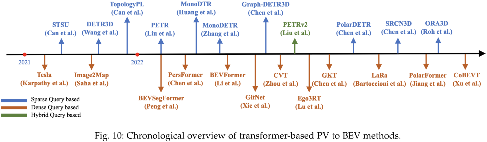 </p>)


Benchmark Results:

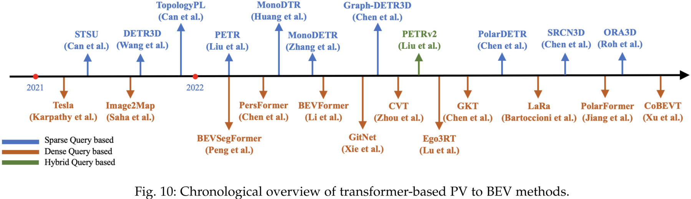
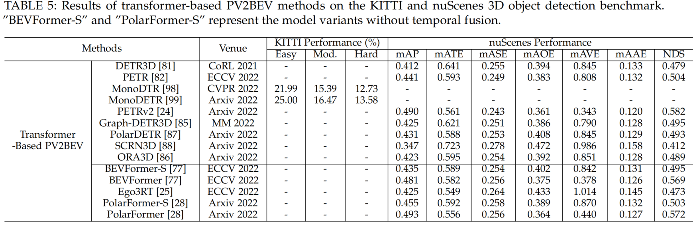

[comment]: <> (<p align="center">  </p>)
[comment]: <> (<p align="center">  </p>)


### (4)  EXTENSION
#### Multi-Task Learning under BEV
- FIERY: Future Instance Prediction in Bird’s-Eye View from Surround Monocular Cameras (ICCV'21) [[paper]](https://openaccess.thecvf.com/content/ICCV2021/papers/Hu_FIERY_Future_Instance_Prediction_in_Birds-Eye_View_From_Surround_Monocular_ICCV_2021_paper.pdf) [[project page]](https://github.com/wayveai/fiery)
- StretchBEV: Stretching Future Instance Prediction Spatially and Temporally (ECCV'22) [[paper]](https://arxiv.org/pdf/2203.13641) [[project page]](https://github.com/kaanakan/stretchbev)
- BEVerse: Unified Perception and Prediction in Birds-Eye-View for Vision-Centric Autonomous Driving (Arxiv'22) [[paper]](https://arxiv.org/pdf/2205.09743) [[project page]](https://github.com/zhangyp15/BEVerse)
- M^2BEV: Multi-Camera Joint 3D Detection and Segmentation with Unified Bird’s-Eye View Representation (Arxiv'22) [[paper]](https://arxiv.org/pdf/2204.05088) [[project page]](https://nvlabs.github.io/M2BEV/)
- STSU: Structured Bird’s-Eye-View Traffic Scene Understanding from Onboard Images (ICCV'21) [[paper]](https://arxiv.org/pdf/2110.01997) [[project page]](https://github.com/ybarancan/STSU)
- BEVFormer: Learning Bird's-Eye-View Representation from Multi-Camera Images via Spatiotemporal Transformers (ECCV'22) [[paper]](https://arxiv.org/pdf/2203.17270v1.pdf) [[project page]](https://github.com/zhiqi-li/BEVFormer)
- Ego3RT: Learning Ego 3D Representation as Ray Tracing (ECCV'22) [[paper]](https://arxiv.org/pdf/2206.04042.pdf) [[project page]](https://github.com/fudan-zvg/Ego3RT)
- PETRv2: A Unified Framework for 3D Perception from Multi-Camera Images (Arxiv'22) [[paper]](https://arxiv.org/pdf/2206.01256) [[project page]](https://github.com/megvii-research/PETR)
- PolarFormer: Multi-camera 3D Object Detection with Polar Transformers (Arxiv'22)[[paper]](https://arxiv.org/pdf/2206.15398) [[project page]](https://github.com/fudan-zvg/PolarFormer)


[comment]: <> (<p align="center">  </p>)
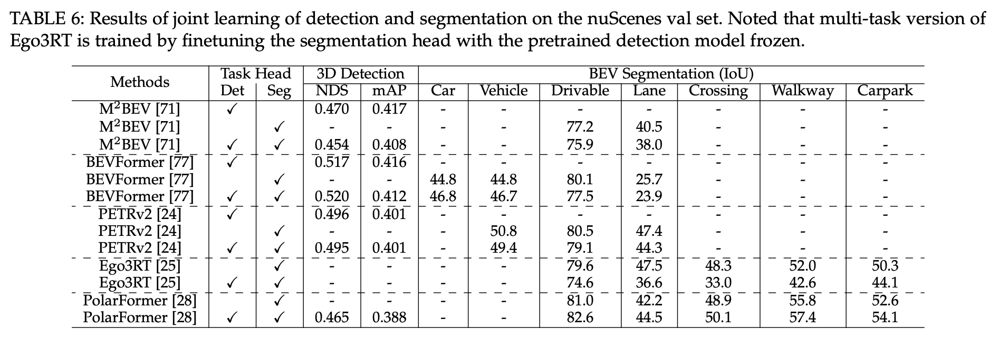

#### Fusion under BEV
Multi-Modality Fusion:
- PointPainting: Sequential Fusion for 3D Object Detection (CVPR'19) [[paper]](https://arxiv.org/pdf/1911.10150.pdf) [[project page]](https://github.com/AmrElsersy/PointPainting)
- 3D-CVF: Generating Joint Camera and LiDAR Features Using Cross-View Spatial Feature Fusion for 3D Object Detection (ECCV'20) [[paper]](https://arxiv.org/pdf/2004.12636.pdf) [[project page]](https://github.com/rasd3/3D-CVF)
- FUTR3D: A Unified Sensor Fusion Framework for 3D Detection (Arxiv'22) [[paper]](https://arxiv.org/pdf/2203.10642) [[project page]](https://github.com/Tsinghua-MARS-Lab/futr3d)
- MVP: Multimodal Virtual Point 3D Detection (NIPS'21) [[paper]](https://arxiv.org/pdf/2111.06881.pdf) [[project page]](https://tianweiy.github.io/mvp/)
- PointAugmenting: Cross-Modal Augmentation for 3D Object Detection (CVPR'21) [[paper]](https://openaccess.thecvf.com/content/CVPR2021/html/Wang_PointAugmenting_Cross-Modal_Augmentation_for_3D_Object_Detection_CVPR_2021_paper.html) [[project page]](https://github.com/VISION-SJTU/PointAugmenting)
- FusionPainting: Multimodal Fusion with Adaptive Attention for 3D Object Detection  (ITSC'21) [[paper]](https://arxiv.org/pdf/2106.12449) [[project page]](https://github.com/Shaoqing26/FusionPainting)
- Unifying Voxel-based Representation with Transformer for 3D Object Detection (Arxiv'21) [[paper]](https://arxiv.org/pdf/2206.00630) [[project page]](https://github.com/dvlab-research/UVTR)
- TransFusion: Robust LiDAR-Camera Fusion for 3D Object Detection with Transformers (CVPR'22) [[paper]](https://arxiv.org/pdf/2203.11496) [[project page]](https://github.com/XuyangBai/TransFusion)
- AutoAlign: Pixel-Instance Feature Aggregation for Multi-Modal 3D Object Detection (IJCAI'22) [[paper]](https://arxiv.org/pdf/2201.06493) [[project page]](https://github.com/zehuichen123/AutoAlignV2)
- AutoAlignV2: Deformable Feature Aggregation for Dynamic Multi-Modal 3D Object Detection (ECCV'22) [[paper]](https://arxiv.org/pdf/2207.10316v1.pdf) [[project page]](https://github.com/zehuichen123/AutoAlignV2)
- CenterFusion: Center-based Radar and Camera Fusion for 3D Object Detection  (WACV'21) [[paper]](https://arxiv.org/pdf]/2011.04841) [[project page]](https://github.com/mrnabati/CenterFusion)

[comment]: <> (<p align="center">  </p>)
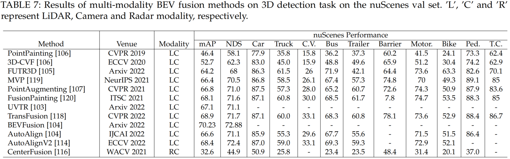

Temporal Fusion:
- BEVDet4D: Exploit Temporal Cues in Multi-camera 3D Object Detection (Arxiv'22) [[paper]](https://arxiv.org/pdf/2203.17054) [[project page]](https://github.com/HuangJunJie2017/BEVDet)
- Image2Map: Translating Images into Maps (ICRA'22) [[paper]](https://arxiv.org/pdf/2110.00966.pdf) [[project page]](https://github.com/avishkarsaha/translating-images-into-maps)
- FIERY: Future Instance Prediction in Bird’s-Eye View from Surround Monocular Cameras (ICCV'21) [[paper]](https://openaccess.thecvf.com/content/ICCV2021/papers/Hu_FIERY_Future_Instance_Prediction_in_Birds-Eye_View_From_Surround_Monocular_ICCV_2021_paper.pdf) [[project page]](https://github.com/wayveai/fiery)
- Ego3RT: Learning Ego 3D Representation as Ray Tracing (ECCV'22) [[paper]](https://arxiv.org/pdf/2206.04042.pdf) [[project page]](https://github.com/fudan-zvg/Ego3RT)
- PolarFormer: Multi-camera 3D Object Detection with Polar Transformers (Arxiv'22)[[paper]](https://arxiv.org/pdf/2206.15398) [[project page]](https://github.com/fudan-zvg/PolarFormer)
- BEVStitch: Understanding Bird’s-Eye View of Road Semantics using an Onboard Camera (ICRA'22) [[paper]](https://arxiv.org/pdf/2012.03040.pdf) [[project page]](https://github.com/ybarancan/BEV_feat_stitch)
- PETRv2: A Unified Framework for 3D Perception from Multi-Camera Images (Arxiv'22) [[paper]](https://arxiv.org/pdf/2206.01256) [[project page]](https://github.com/megvii-research/PETR)
- BEVFormer: Learning Bird's-Eye-View Representation from Multi-Camera Images via Spatiotemporal Transformers (ECCV'22) [[paper]](https://arxiv.org/pdf/2203.17270v1.pdf) [[project page]](https://github.com/zhiqi-li/BEVFormer)
- UniFormer: Unified Multi-view Fusion Transformer for Spatial-Temporal Representation in Bird’s-Eye-View (Arxiv'22) [[paper]](https://arxiv.org/pdf/2207.08536) 
- DfM: Monocular 3D Object Detection with Depth from Motion (ECCV'22) [[paper]](https://arxiv.org/pdf/2207.12988.pdf) [[project page]](https://github.com/Tai-Wang/Depth-from-Motion)

[comment]: <> (<p align="center">  </p>)
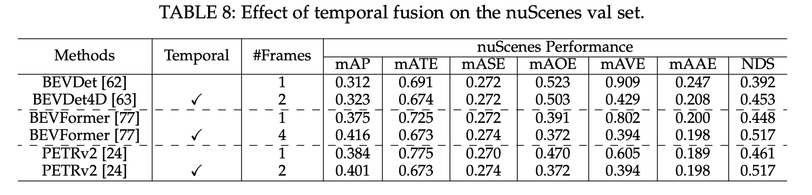

Multi-agent Fusion:
- CoBEVT: Cooperative Bird's Eye View Semantic Segmentation with Sparse Transformers (Arxiv'22)  [[paper]](https://arxiv.org/pdf/2207.02202.pdf)


#### Empirical Know-Hows
[comment]: <> (<p align="center">  </p>)
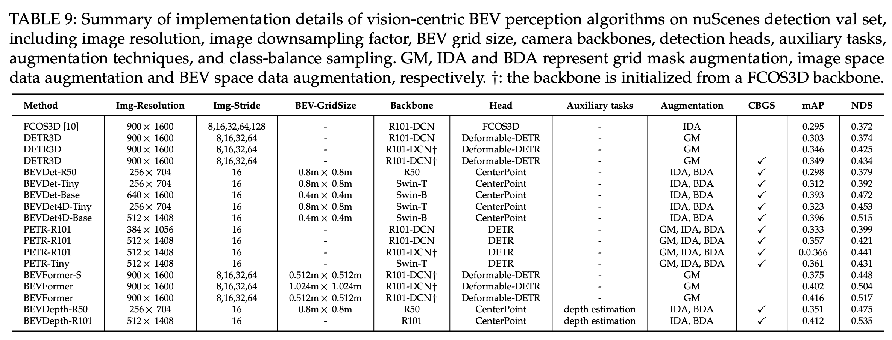

### Citation

If you find our work useful in your research, please consider citing:

```tex
@inproceedings{Ma2022VisionCentricBP,
  title={Vision-Centric BEV Perception: A Survey},
  author={Yuexin Ma and Tai Wang and Xuyang Bai and Huitong Yang and Yuenan Hou and Yaming Wang and Y. Qiao and Ruigang Yang and Dinesh Manocha and Xinge Zhu},
  year={2022}
}
```

## Contributing

Please feel free to submit a pull request to add the new paper or related project page.


## Related Repos

