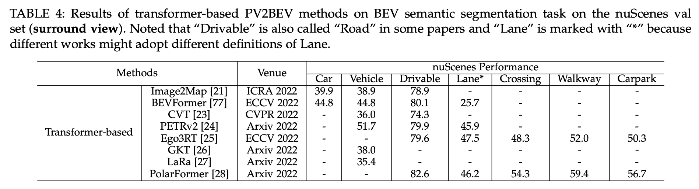

# Vision-Centric-BEV-Perception
Vision-Centric BEV Perception: A Survey

## Introduction

### (1) Datasets

### (2) GEOMETRY BASED PV2BEV

- BridgeGAN (3DV'18) [[paper]](https://arxiv.org/pdf/1808.00327.pdf)
- 3D-LaneNet (ICCV'19) [[paper]](https://openaccess.thecvf.com/content_ICCV_2019/papers/Garnett_3D-LaneNet_End-to-End_3D_Multiple_Lane_Detection_ICCV_2019_paper.pdf)
- TrafCam3D (IROS'21) [[paper]](http://export.arxiv.org/pdf/2103.15293.pdf)
- PartNet (WACV'21) [[paper]](https://openaccess.thecvf.com/content/WACV2021/papers/Loukkal_Driving_Among_Flatmobiles_Bird-Eye-View_Occupancy_Grids_From_a_Monocular_Camera_WACV_2021_paper.pdf) 
- ScanObjectNN (ICCV'21) [[paper]](https://openaccess.thecvf.com/content/ICCV2021/papers/Song_Stacked_Homography_Transformations_for_Multi-View_Pedestrian_Detection_ICCV_2021_paper.pdf) 
#### Chronological overview of homograph-based PV to BEV methods.

### (3) Depth based PV2BEV

- LSS (ECCV'20) [[paper]](https://arxiv.org/pdf/2008.05711.pdf) [[project page]](https://nv-tlabs.github.io/lift-splat-shoot/)
- CaDDN (CVPR'21) [[paper]](https://openaccess.thecvf.com/content/CVPR2021/papers/Reading_Categorical_Depth_Distribution_Network_for_Monocular_3D_Object_Detection_CVPR_2021_paper.pdf) [[project page]](https://github.com/TRAILab/CaDDN)
- FIERY (ICCV'21) [[paper]](https://openaccess.thecvf.com/content/ICCV2021/papers/Hu_FIERY_Future_Instance_Prediction_in_Birds-Eye_View_From_Surround_Monocular_ICCV_2021_paper.pdf) [[project page]](https://github.com/wayveai/fiery)
- Dfm (ECCV'22) [[paper]](https://arxiv.org/abs/2207.12988.pdf) [[project page]](https://github.com/Tai-Wang/Depth-from-Motion)
- ImvoxelNet (WACV'22) [[paper]](https://arxiv.org/pdf/2106.01178.pdf) [[project page]](https://github.com/saic-vul/imvoxelnet)

#### Chronological overview of depth-based PV to BEV methods.

#### Benchmark Results

### (4) NETWORK BASED PV2BEV

##### MLP-based
- VED (RA-L'19) [[paper]](https://arxiv.org/pdf/1804.02176.pdf) [[project page]](http://www.semantic3d.net/)
- VPN (IROS'20) [[paper]](https://arxiv.org/pdf/1906.03560.pdf) [[project page]](https://view-parsing-network.github.io/)
- PON (CVPR'20) [[paper]](https://openaccess.thecvf.com/content_CVPR_2020/papers/Roddick_Predicting_Semantic_Map_Representations_From_Images_Using_Pyramid_Occupancy_Networks_CVPR_2020_paper.pdf)
- STA-ST (ICRA'21) [[paper]](https://ieeexplore.ieee.org/stamp/stamp.jsp?tp=&arnumber=9561169) 
####  Chronological overview of MLP-based PV to BEV methods.

#### Benchmark Results

##### Transformer-based
- BEVFormer (ECCV'22) [[paper]](https://arxiv.org/pdf/2203.17270v1.pdf) [[project page]](https://github.com/zhiqi-li/BEVFormer)
- CVT (CVPR'22) [[paper]](https://openaccess.thecvf.com/content/CVPR2022/papers/Zhou_Cross-View_Transformers_for_Real-Time_Map-View_Semantic_Segmentation_CVPR_2022_paper.pdf) [[project page]](https://github.com/bradyz/)
- Ego3RT (ECCV'22) [[paper]](https://arxiv.org/pdf/2206.04042.pdf)

#### Chronological overview of transformer-based PV to BEV methods.

#### Benchmark Results

### (5)  EXTENSION

##### Multi-Modality Fusion
- PointPainting (CVPR'19) [[paper]](https://arxiv.org/pdf/1911.10150.pdf) [[project page]](https://github.com/AmrElsersy/PointPainting)
- 3D-CVF (ECCV'20) [[paper]](https://arxiv.org/abs/2004.12636.pdf) [[project page]](https://github.com/rasd3/3D-CVF)
- MVP (NIPS'21) [[paper]](https://arxiv.org/pdf/2111.06881.pdf) [[project page]](https://tianweiy.github.io/mvp/)
- AutoAlignV2 (ECCV'22) [[paper]](https://arxiv.org/pdf/2207.10316v1.pdf) [[project page]](https://github.com/zehuichen123/AutoAlignV2)
#### Benchmark Results

### Citation

## Updates

## Related Repos

